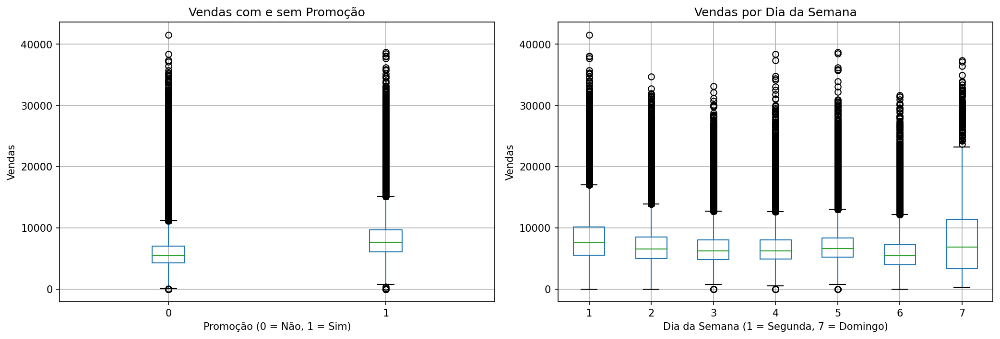

# Aplicação de Modelos de Regressão na Previsão de Vendas e Gestão de Stocks da Rossmann
## Identificação da Equipa
* **Membros:**
 * Tomás Moreira - 2023143375

## Organização do Repositório
A estrutura deste projeto segue as boas práticas de Ciência de Dados e Engenharia de Software:
* **`data/`**: Armazenamento de dados (dados brutos em `raw/` e processados em `processed/`).
* **`docs/`**: Documentação técnica detalhada dividida por Milestones (M1, M2, M3 e M4).
* **`notebooks/`**: Jupyter Notebooks para experimentação, limpeza e modelação.
* **`src/`**: Código-fonte modular (scripts `.py`) para funções reutilizáveis.
* **`reports/`**: Relatórios finais, apresentações e exportação de figuras (`figures/`).
* **`requirements.txt`**: Ficheiro de configuração com as bibliotecas necessárias.
## 1. Iniciação (Milestone 1)
### Contexto e Problema de Negócio
O setor do retalho exige um planeamento rigoroso para garantir a adequação do inventário à procura diária. A Rossmann, uma cadeia de retalho especializada com mais de mil estabelecimentos, enfrenta o desafio constante de antecipar o volume de transações em cada local. Uma estimativa incorreta pode resultar em ruturas nas prateleiras, o que afasta consumidores para a concorrência, ou na acumulação excessiva de mercadoria, o que imobiliza capital financeiro de forma ineficiente. A complexidade deste planeamento reside na elevada volatilidade do comportamento de compra, influenciado por campanhas promocionais, pela ocorrência de feriados e pela concorrência local. O objetivo deste projeto é criar um modelo que aprenda com o histórico de vendas e preveja as vendas futuras de cada loja, ajudando a decidir melhor o reabastecimento.

### Objetivos do Projeto
**Objetivo SMART:** Desenvolver um modelo de regressão para estimar o volume de vendas diárias por loja da cadeia Rossmann, com base no histórico de vendas de janeiro de 2013 a julho de 2015, atingindo um erro percentual médio (RMSPE) igual ou inferior a 20% e um coeficiente de determinação (R²) igual ou superior a 0,85, até dia 14 de junho de 2026.

### Perguntas de Investigação
1. Quais são os fatores que mais influenciam o volume de vendas diárias das lojas Rossmann?
2. Existe relação entre a realização de promoções e o aumento das vendas?
3. De que forma os dias festivos e os fins de semana afetam o volume de vendas?
4. Quais são as variáveis que mais contribuem para a previsão das vendas no modelo final?
5. O tipo de loja e a variedade de produtos influenciam o comportamento das vendas?

### Fonte de Dados
| Característica | Detalhe Analítico |
| :--- | :--- |
| Dataset | Rossmann Store Sales |
| Fonte principal | Kaggle |
| Link | https://www.kaggle.com/datasets/shahpranshu27/rossman-store-sales |
| Dimensão | 1 017 209 observações no histórico de treino e 1 115 registos no perfil das lojas |
| Variável Alvo | Sales (Volume numérico e contínuo da faturação diária) |
| Descrição | O conjunto de dados documenta o histórico transacional diário e as características de cada loja, suportando a criação do modelo preditivo para a otimização de inventário. |
## 2. Exploração (Milestone 2)

### Limpeza e Preparação
Os dados de vendas e de lojas foram unidos numa única tabela. A tabela de vendas não apresentava valores em falta. Os valores em falta concentravam-se nas características das lojas e correspondiam a ausências de evento, como lojas sem concorrente próximo ou sem adesão a promoções contínuas, pelo que foram preenchidos com critério. Foram removidos 54 registos de lojas abertas sem qualquer venda, por não refletirem o funcionamento normal. As variáveis categóricas foram codificadas com One-Hot Encoding e foram criadas novas variáveis de calendário e de combinação de atributos. Os detalhes encontram-se em [`docs/M2_exploracao.md`](docs/M2_exploracao.md).

### Principais Conclusões (EDA)

* O número de clientes é o fator mais associado às vendas (correlação de 0,82), mas não pode ser usado na previsão por só ser conhecido no final do dia.
* As promoções aumentam as vendas, sendo uma das variáveis mais úteis para o modelo.
* As vendas descem ao fim de semana, com o Domingo a destacar-se pelo encerramento da maioria das lojas.
* O tipo de loja "b", apesar de ser o menos frequente, é o que regista vendas medianas mais elevadas.
* As variáveis originais têm, de forma isolada, uma relação fraca com as vendas, o que justificou a criação de novas variáveis na fase de engenharia de atributos.
> **Síntese:** A análise mostrou que nenhuma variável explica as vendas de forma isolada. O comportamento das vendas resulta da combinação de vários fatores, como promoções, calendário e perfil da loja. Esta conclusão levou à criação de novas variáveis e a escolha de modelos capazes de cruzar todas estas dimensões em simultâneo, preparando o terreno para a fase de modelação.

## 3. Modelação (Milestone 3)

### Abordagem Técnica
* **Modelos testados:** Regressão Linear (baseline), Random Forest e XGBoost.
* **Modelo final:** XGBoost otimizado (500 árvores, profundidade máxima de 8, taxa de aprendizagem de 0,2).
* **Métricas principais:** RMSPE (erro percentual), MAE (erro em euros) e R² (poder explicativo).
* **Validação:** divisão temporal dos dados (80% treino, 20% teste) e validação cruzada com 5 dobras.

### Resultados do Modelo Final

| Métrica | Resultado (Teste) | Meta SMART | Cumprido |
| :--- | :---: | :---: | :---: |
| RMSPE | 15,92% | ≤ 20% | Sim |
| R² | 0,8677 | ≥ 0,85 | Sim |
| MAE | 761,68 € | — | — |

O modelo final cumpriu os dois critérios definidos no objetivo SMART. O R² subiu de 0,20 no modelo de base para 0,87 no modelo final, e o erro médio das previsões desceu de 1929 para 762 euros. Os fatores mais determinantes nas vendas revelaram-se o tipo de loja e as promoções. Os detalhes encontram-se em [`docs/M3_modelacao.md`](docs/M3_modelacao.md).
## 4. Finalização (Milestone 4)
### Resposta ao Problema
[Resumo da solução e como ela gera valor para o negócio.]
### Recomendações de Inovação
1. [Sugestão prática baseada nos resultados]
## Como Reproduzir este Projeto
1. Clone o repositório: `git clone [url-do-repo]`
2. Instale as dependências: `pip install -r requirements.txt`
3. Execute os notebooks na pasta `notebooks/` seguindo a ordem numérica.
**Instituição:** Coimbra Business School | ISCAC
**Curso:** Licenciatura em Ciência de Dados para a Gestão
**Unidade Curricular:** Projeto em Ciência de Dados
**Professor Responsável:** Dora Melo (dmelo@iscac.pt)
